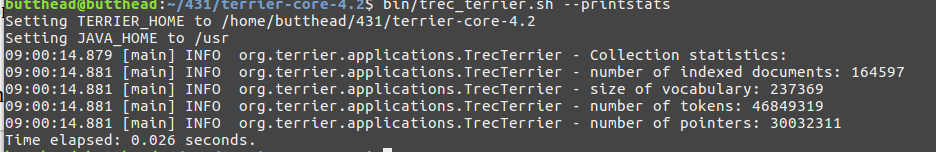
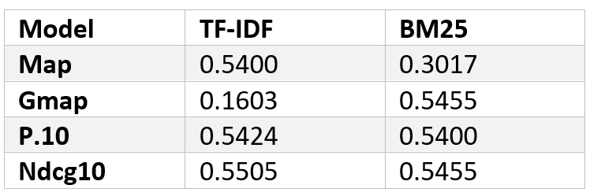
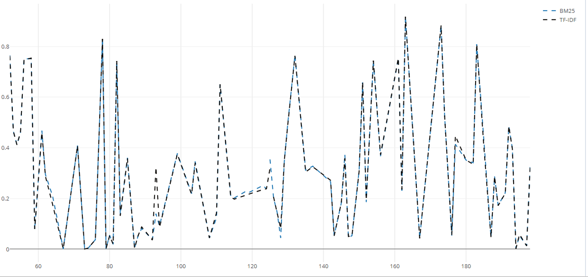
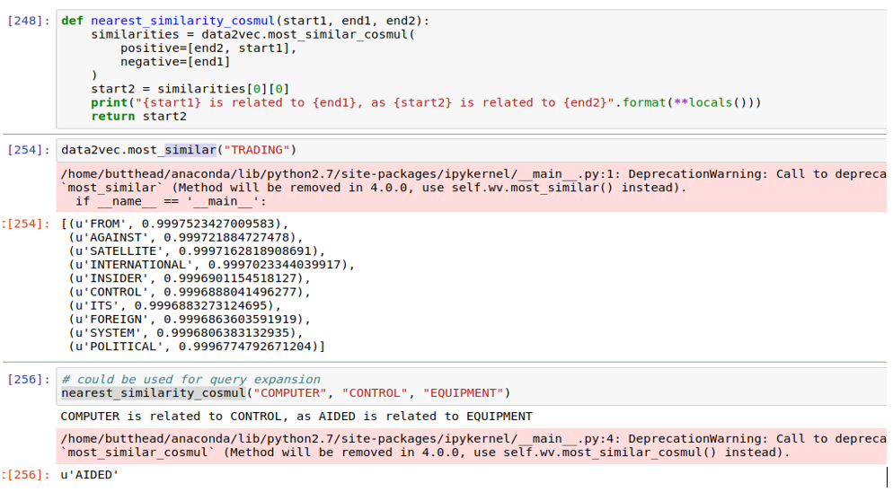

# Information-Retrieval

# The Project 
The project was to implement and evaluate a query expansion technique based on word embeddings.

# Task 1
The Terrier search engine architecture was used for this project in which the collection was indexed with using a Porter Stemmer algorithm. 

# Task 2
A number of baseline were run 

# Task 3 and 4
Implement a query expansion technique based on word embeddings, I used the cosine similarity to try and improve my results

# Results
